# Documentação do Pipeline

Trabalho final de Stream Processing Pipelines. Construímos um pipeline de streaming com Apache Spark Structured Streaming, rodando no Databricks, que ingere corridas de táxi de Nova York em CSV, valida os dados e grava o resultado em Parquet.

Dataset: NYC Yellow Taxi Trip Data, baixado do NYC Open Data (a própria base da TLC, já que hoje eles só disponibilizam Parquet direto no site deles).

## Parte 1: Ingestão, validação e output

### 1. Setup e sessão Spark

O notebook confere se a versão do pyspark instalada é compatível (3.5.x) e cria a sessão Spark. No Databricks isso é rápido porque o cluster já vem com tudo pronto.

### 2. Ambiente e armazenamento

O notebook detecta sozinho se está rodando no Databricks ou local, e ajusta os caminhos de arquivo. No Databricks, testamos algumas opções (DBFS, disco local, pasta do Workspace) até chegar num Unity Catalog Volume, que é o formato de armazenamento aceito nesse tipo de cluster pra leitura, escrita e checkpoint de streaming.

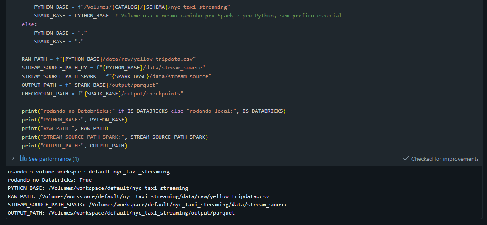

### 3. Download dos dados

Baixamos uma amostra real de corridas (primeira semana de janeiro de 2023, por volta de 5000 linhas) direto do NYC Open Data. Se o arquivo já existir, ele não baixa de novo.

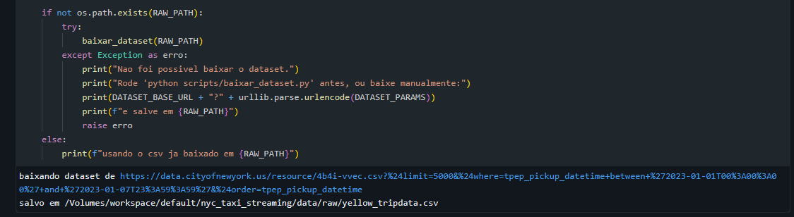

### 4. Schema dos dados

Definimos o schema na mão, com os tipos de cada coluna (datas, valores numéricos, texto), porque o Spark Structured Streaming exige um schema fixo, não dá pra inferir sozinho como em leitura normal.

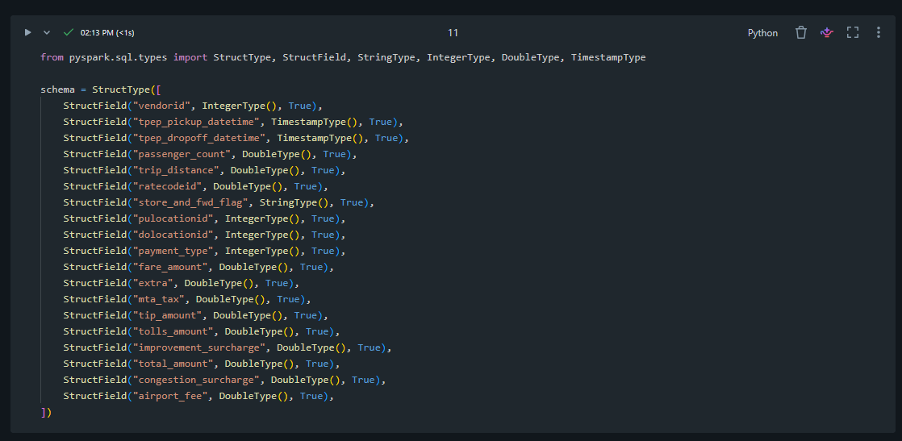

### 5. Simulando a chegada dos dados

Como a TLC libera os dados em lote, simulamos o efeito de streaming particionando o CSV baixado em pedaços de 200 linhas e escrevendo eles aos poucos numa pasta, um arquivo a cada 2 segundos.

### 6. Ingestão e validação (filtro)

O `readStream` lê os arquivos dessa pasta com o schema definido. Em seguida aplicamos o filtro: descartamos corrida sem passageiro, sem distância, com tarifa zerada ou negativa, e qualquer linha com campo essencial vazio. O dataset real já vem com algumas dessas inconsistências, então esse filtro tem efeito de verdade nos dados, não é só um exemplo teórico.

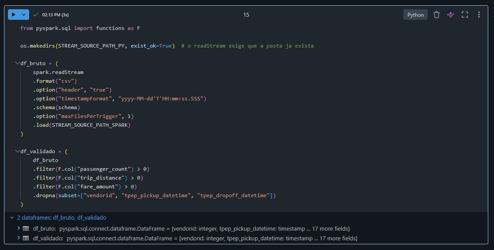

### 7. Output em Parquet

Configuramos a escrita do resultado validado em Parquet, com checkpoint. Como o cluster usado é serverless e não aceita o trigger contínuo padrão do Structured Streaming, usamos o trigger `availableNow`, que processa tudo que estiver disponível na pasta no momento em que a query é iniciada e depois para sozinho.

### 8. Rodando o pipeline

Aqui a simulação de arquivos roda de verdade, e logo em seguida a query é iniciada e processa os arquivos gerados.

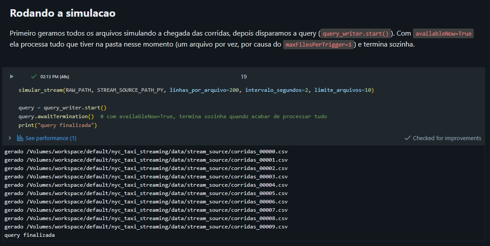

### 9. Resultado

Por fim, lemos de volta o Parquet gravado, pra confirmar visualmente que o pipeline funcionou.

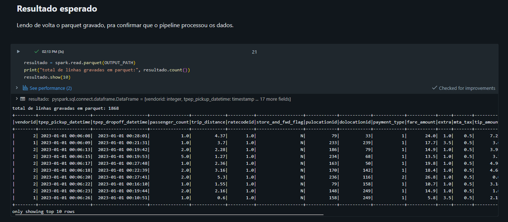

## Parte 2: Agregação, Window e Deploy

### 1. Agregação por janela de tempo (Window)

Partindo do `df_validado` definido na Parte 1, agrupamos as corridas em **janelas de 1 hora** pelo horário de embarque (`tpep_pickup_datetime`), separadas por tipo de pagamento. Para cada janela calculamos: total de corridas, média de tarifa, média de distância percorrida e receita total (`total_amount`).

O `withWatermark("tpep_pickup_datetime", "10 minutes")` diz ao Spark por quanto tempo uma janela ainda pode receber dados atrasados — depois desse prazo, a janela é fechada e o resultado é emitido. Esse mecanismo é obrigatório para usar `outputMode("append")` com agregações em streaming; sem ele o Spark não sabe quando uma janela está "completa" e não consegue garantir que não vai receber mais dados para ela.

### 2. Query de agregação

A query usa `foreachBatch` com `outputMode("update")` e `trigger(availableNow=True)`. Optamos por `foreachBatch` em vez do `writeStream` direto com `format("parquet")` porque o modo `append` com watermark em dados históricos processados via `availableNow` não emite resultados — as janelas nunca fecham sem um micro-batch posterior para acionar a emissão. Com `foreachBatch` + `update`, cada micro-batch grava as janelas atualizadas imediatamente, sem depender do watermark. O resultado é gravado em `output/parquet_aggs`, com uma linha por combinação de (janela de 1 hora × tipo de pagamento).

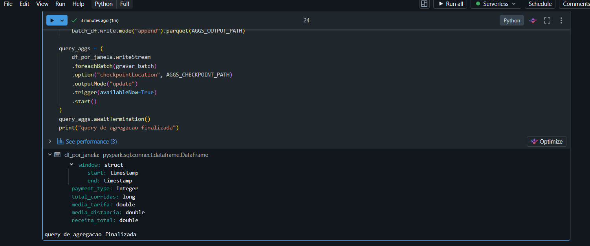

### 3. Resultado das agregações

Após a query terminar, lemos o Parquet de volta e exibimos as janelas ordenadas por horário e tipo de pagamento. Como o modo `update` pode gravar a mesma janela em mais de um batch, aplicamos uma deduplicação para ficar só com o estado final de cada janela. O número de linhas é muito menor do que a saída da Parte 1 — cada linha representa uma janela de 1 hora, não uma corrida individual.

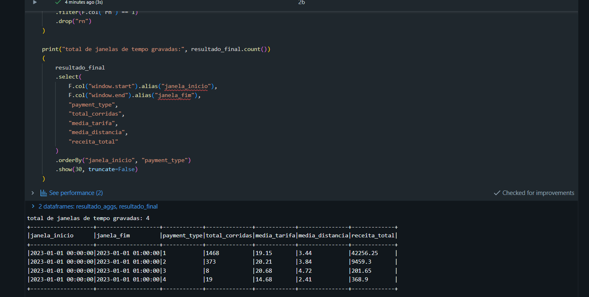

### 4. Deploy no Databricks

Com o pipeline validado e funcionando, configuramos um **Job** no Databricks (em Jobs & Pipelines) para que ele rode automaticamente sem intervenção manual. O job aponta para este notebook, usa o mesmo cluster serverless dos testes e pode ser agendado com a frequência desejada. A célula de deploy imprime o caminho exato do notebook dentro do workspace, que foi usado para configurar o job.

Nos prints abaixo é possível ver o job criado, o histórico de execuções e o agendamento configurado.

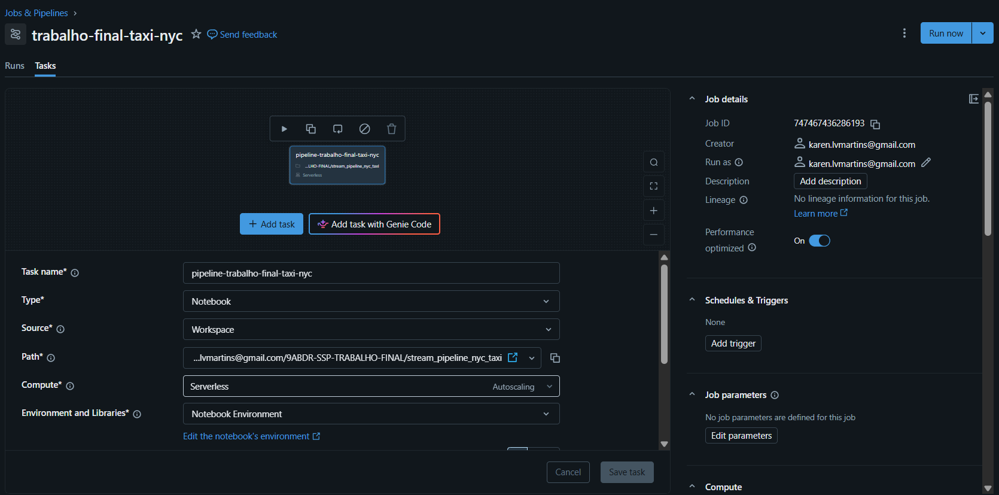

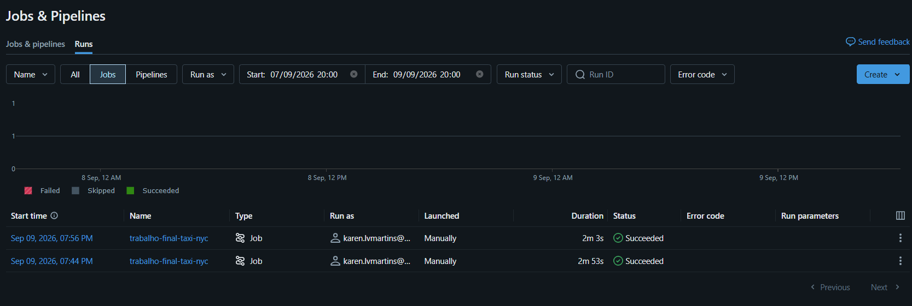

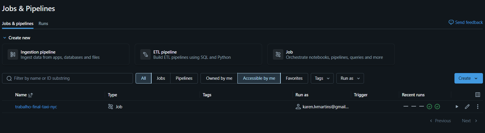
